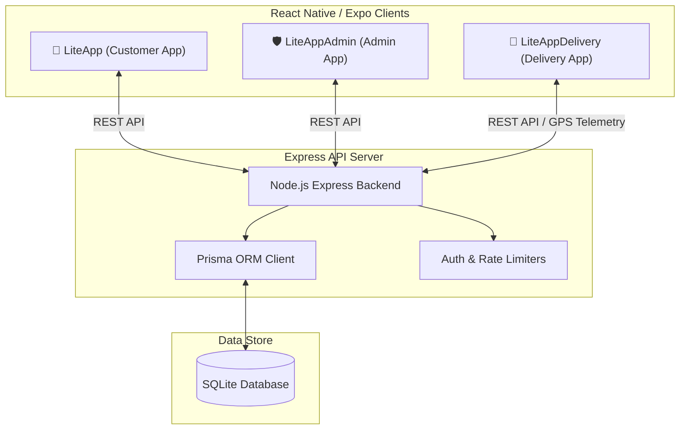

# 🛒 LiteApp: Grocery Quick-Commerce Ecosystem

[](https://reactnative.dev/)
[](https://www.prisma.io/)
[](https://expressjs.com/)
[](https://www.sqlite.org/)

LiteApp is a modern, production-grade quick-commerce grocery delivery system. It features a complete multi-app ecosystem powering customer ordering, rider onboarding and delivery tracking, and administrative control, all backed by a high-performance Express server and Prisma ORM.

---

## 📱 Ecosystem Architecture

LiteApp is structured as a monorepo consisting of four primary modules:



---

## 📦 Project Modules

### 1. 📱 LiteApp (Customer App)
The customer-facing application built with **React Native (Expo)**. It provides a fluid, high-performance shopping experience.
* **Key Features:**
  * Interactive grocery product catalog & smart search.
  * Wishlist & Favorites filters (with specialized categorizations).
  * Geolocation-aware checkout using interactive maps (Jalgaon & Bhusawal region locks).
  * Real-time order tracking notifications on the Home Screen.
  * In-app Wallet section under Account menu.
  * Razorpay checkout integration.

### 2. 🚴 LiteAppDelivery (Delivery App)
The logistics and delivery partner application built with **React Native (Expo)**.
* **Key Features:**
  * Multi-step rider KYC onboarding & document upload (Aadhaar, PAN, DL, RC, Selfie).
  * Real-time GPS location tracking & telemetry broadcast.
  * Order dispatch matching & single-tap status transition management (`Accepted` ➡️ `PickedUp` ➡️ `Delivered`).
  * Earnings dashboard with daily, weekly, and incentive reports.
  * Driver wallet balances, payout history, and profile badges.

### 3. 🛡️ LiteAppAdmin (Admin Dashboard App)
The control hub for administrative operations built with **React Native (Expo)**.
* **Key Features:**
  * Product and inventory management (add, edit, toggle availability).
  * Delivery rider KYC approval queue (view and approve/reject credentials).
  * Real-time order assignments and hybrid dispatcher mapping.
  * Financial metrics, active delivery roster, and trust score monitoring.

### 4. ⚙️ LiteAppBackend (API Server)
A lightweight, high-performance REST API built with **Express.js** and **Prisma ORM**.
* **Key Features:**
  * Secure JSON Web Token (JWT) authentication & password hashing (bcryptjs).
  * Advanced database models mapping users, products, orders, delivery partners, assignments, and earning logs.
  * Helmet security headers & rate limiters to protect endpoints.
  * Automatic Expo Metro host IP resolution to simplify local network development.

---

## 🛠️ Technology Stack

| Component | Technologies Used |
| :--- | :--- |
| **Mobile Apps** | React Native, Expo, React Navigation, Lottie, Expo Location & Maps |
| **Backend API** | Node.js, Express.js, JWT, Bcryptjs, Helmet |
| **Database & ORM** | Prisma ORM, SQLite (dev.db) |
| **Integrations** | Razorpay Payment Gateway, Google Places API |

---

## 🚀 Getting Started

### Prerequisites
Make sure you have the following installed:
* [Node.js](https://nodejs.org/) (v18 or higher recommended)
* [Expo Go](https://expo.dev/go) app on your physical mobile device to run and preview the apps.

---

### 📥 Installation & Setup

#### 1. Clone the Repository
```bash
git clone <your-repo-url>
cd LiteApp13
```

#### 2. Setup the Backend Server
1. Navigate to the backend directory:
   ```bash
   cd LiteAppBackend
   ```
2. Install dependencies:
   ```bash
   npm install
   ```
3. Initialize the Prisma database:
   ```bash
   npx prisma generate
   npx prisma db push
   ```
4. Start the backend developer server:
   ```bash
   npm run dev
   ```

#### 3. Setup the Mobile Apps
Each mobile application folder (`LiteApp`, `LiteAppAdmin`, `LiteAppDelivery`) shares a similar setup process. 

For each application directory (e.g., `LiteApp`):
1. Navigate to the app directory:
   ```bash
   cd ../LiteApp
   ```
2. Install dependencies:
   ```bash
   npm install
   ```
3. Start the Metro packager:
   ```bash
   npx expo start -c
   ```
4. Open the app using **Expo Go** by scanning the QR code printed in the terminal.

---

## 💡 Developer Configuration (Dynamic IP Resolution)

To avoid hardcoding IP addresses in `.env` files for local development, the client apps dynamically read the host IP of your development computer running the Metro packager. 

They retrieve the connection address via:
```javascript
import Constants from 'expo-constants';
const hostUri = Constants.expoConfig?.hostUri;
const localIp = hostUri ? hostUri.split(':')[0] : 'localhost';
const API_URL = `http://${localIp}:5000/api`;
```
This guarantees that you can connect your physical test devices to your development server seamlessly across different Wi-Fi networks!

---

## 🔒 Security & Performance
* **Helmet**: Secure headers enabled.
* **Express Rate Limiter**: Limits brute-force attempts on sensitive endpoints.
* **Verification Checks**: Orders are validated against geographic zones (Jalgaon & Bhusawal) using distance matrices and coordinate bounds.
