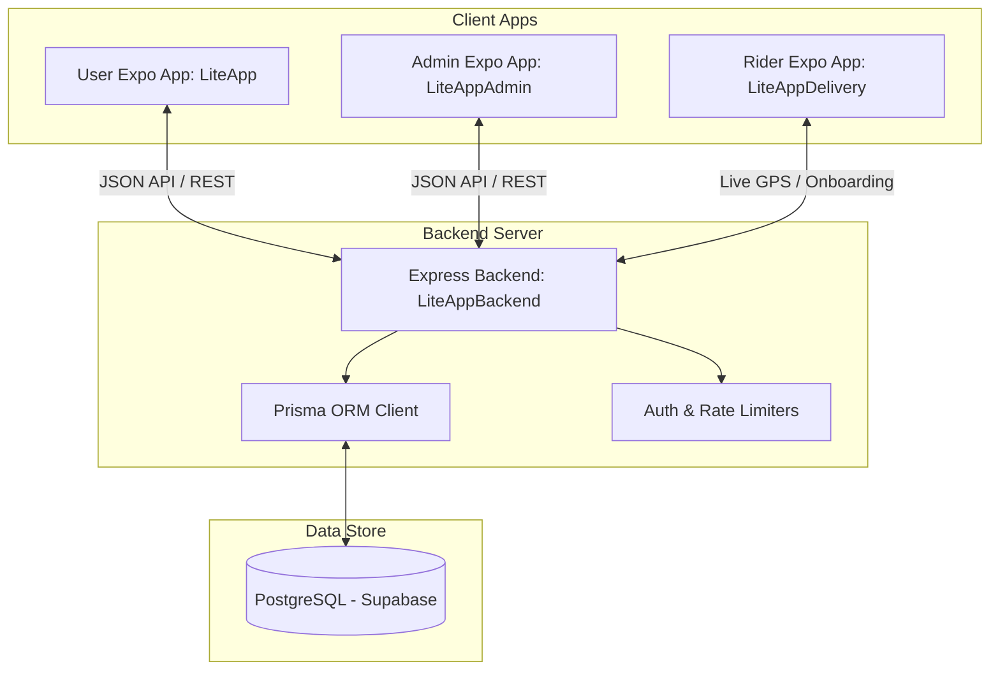
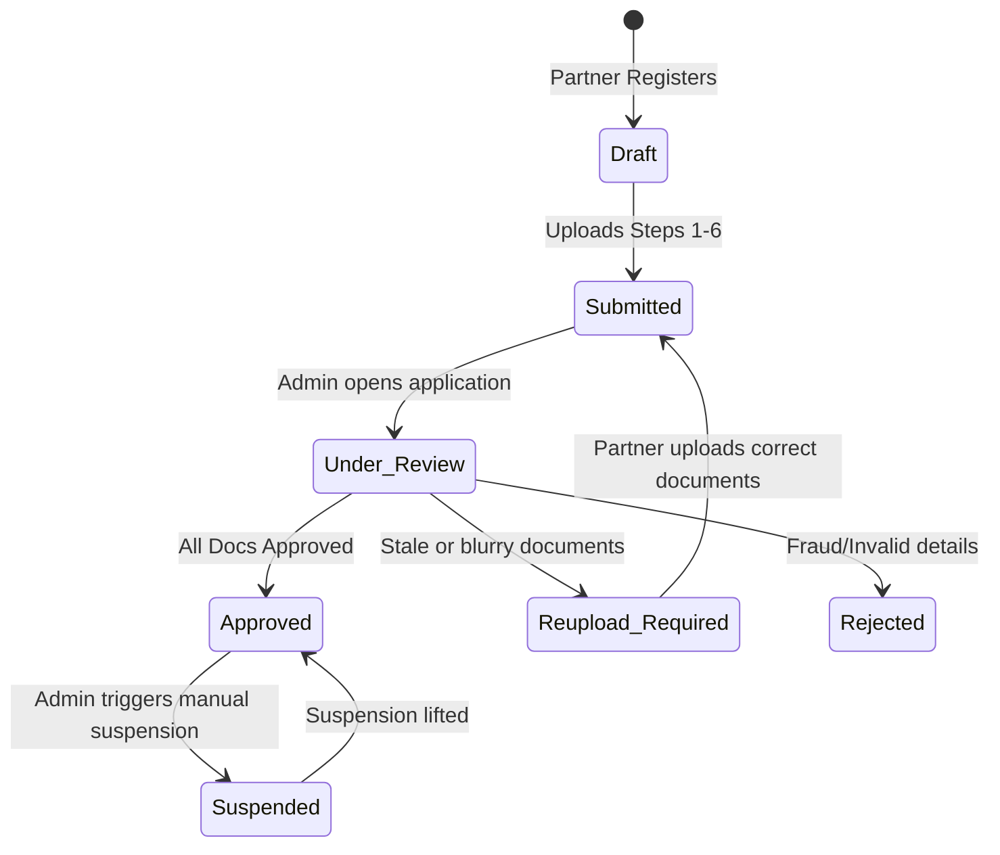
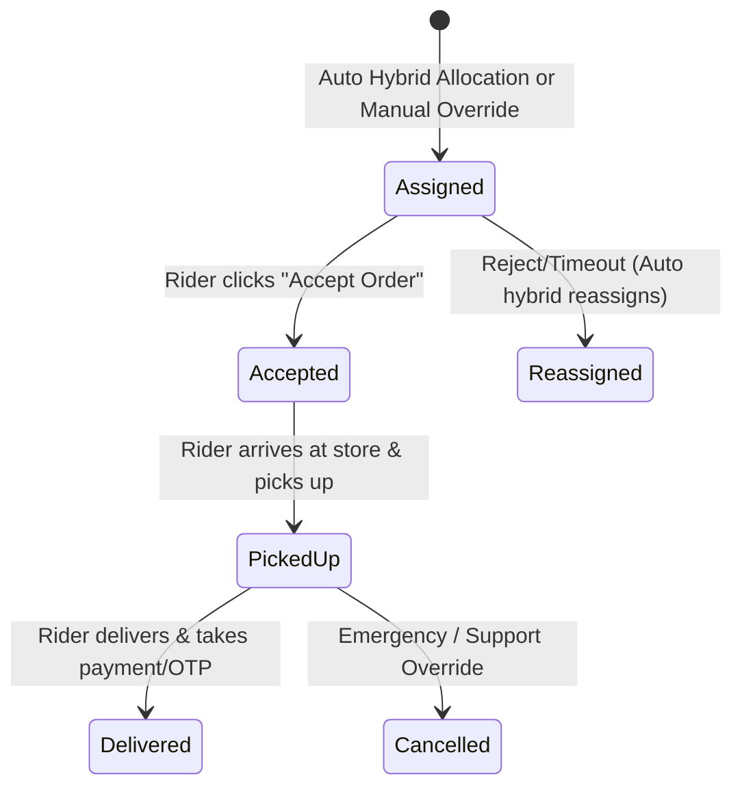

# Implementation Plan - Dynamic IP, Authentication Fixes & Delivery Partner Ecosystem

This comprehensive plan covers two phases:
- **Phase 1**: Instant fixes for the Dynamic IP issue, authentication timeouts, and password resets in both `LiteApp` and `LiteAppAdmin`.
- **Phase 2**: Full-scale design and development of the **Delivery Partner Management Ecosystem** consisting of a new Mobile App (`LiteAppDelivery`), backend routing & DB migrations, Admin control screens, and live user tracking integrations.

---

## 1. User Review Required

> [!IMPORTANT]
> **Dynamic IP Resolution (Phase 1)**:
> Points both mobile applications dynamically to your local development machine's running Metro packager IP address using `Constants.expoConfig.hostUri`. This means you will **never** have to change the IP address in your `.env` files manually again when moving between Wi-Fi networks or hotspots.
>
> **Authentication Speed Up**:
> The slow login and password reset delays are **directly resolved** by fixing this IP routing. Stale IP connections were previously hanging and waiting for TCP timeouts before throwing network errors.

> [!WARNING]
> **Delivery Partner Schema Migrations (Phase 2)**:
> In Phase 2, we will migrate your PostgreSQL database to support the delivery partner data model. This migration is designed to preserve all existing orders, categories, and products without any data loss.

---

## 2. Production Scalable System Architecture

The Delivery Partner Ecosystem is integrated directly with your existing grocery quick-commerce stack.



---

## 3. Database Schema Design (Prisma)

We will append the following three production-ready models to `LiteAppBackend/prisma/schema.prisma`.

```prisma
// --- DELIVERY PARTNER ECOSYSTEM ---

model DeliveryPartner {
  id                 String               @id @default(uuid())
  name               String
  phone              String               @unique
  email              String               @unique
  password           String
  dob                String?
  gender             String?
  address            String?
  avatar             String?              // Profile Photo URL
  
  // KYC Verification Status
  verificationStatus String               @default("Draft") // 'Draft', 'Submitted', 'Under_Review', 'Reupload_Required', 'Approved', 'Rejected', 'Suspended'
  reuploadRemarks    String?
  
  // KYC Documents
  aadhaarUrl         String?
  panUrl             String?
  selfieUrl          String?
  
  // Vehicle Info
  vehicleType        String?              // 'Bike', 'Scooter', 'Cycle'
  vehicleNumber      String?
  rcUrl              String?
  dlUrl              String?
  
  // Bank Details
  accountNumber      String?
  ifsc               String?
  upiId              String?
  
  // Emergency Contact
  emergencyName      String?
  emergencyPhone     String?
  
  // Real-time Status & Telemetry
  rating             Float                @default(5.0)
  deliveriesCount    Int                  @default(0)
  trustScore         Int                  @default(100)
  isOnline           Boolean              @default(false)
  latitude           Float?
  longitude          Float?
  
  // Financial Wallet & Balances
  walletBalance      Float                @default(0.0)
  earnings           Float                @default(0.0)
  incentives         Float                @default(0.0)
  
  createdAt          DateTime             @default(now())
  updatedAt          DateTime             @updatedAt

  assignments        DeliveryAssignment[]
  earningsLogs       EarningLog[]
}

model DeliveryAssignment {
  id               String           @id @default(uuid())
  orderId          String           @unique
  partnerId        String
  status           String           @default("Assigned") // 'Assigned', 'Accepted', 'PickedUp', 'Delivered', 'Cancelled'
  
  assignedAt       DateTime         @default(now())
  acceptedAt       DateTime?
  pickedUpAt       DateTime?
  deliveredAt      DateTime?
  cancelledAt      DateTime?
  
  partner          DeliveryPartner  @relation(fields: [partnerId], references: [id], onDelete: Cascade)
  order            Order            @relation(fields: [orderId], references: [id], onDelete: Cascade)
}

model EarningLog {
  id               String           @id @default(uuid())
  partnerId        String
  orderId          String
  amount           Float
  type             String           @default("DeliveryFee") // 'DeliveryFee', 'Incentive', 'Bonus'
  createdAt        DateTime         @default(now())
  
  partner          DeliveryPartner  @relation(fields: [partnerId], references: [id], onDelete: Cascade)
}
```

And inside your existing **`Order`** model:
```prisma
model Order {
  // ... existing fields ...
  deliveryAssignment DeliveryAssignment?
}
```

---

## 4. Workflows & State Transition Diagrams

### A. Onboarding Document & Verification State Transition


### B. Delivery Assignment State Transition


---

## 5. API Architecture (Backend Endpoints)

We will introduce a dedicated group of routes in `LiteAppBackend/index.js`.

### Authentication & Multi-Step Onboarding
* `POST /api/delivery/register`: Create profile in `Draft` state.
* `POST /api/delivery/login`: Secure login for registered riders.
* `PATCH /api/delivery/onboard`: Step-by-step metadata & document updates.
* `GET /api/delivery/profile`: Fetch real-time rider profiles.

### Assignment & Dispatch Engine
* `GET /api/delivery/orders/available`: Retrieve available or assigned orders.
* `PATCH /api/delivery/orders/:id/status`: Update status (`Accepted`, `PickedUp`, `Delivered`).
* `POST /api/delivery/location`: Live telemetry location ping.

### Earnings & Wallet
* `GET /api/delivery/earnings`: Retrieve daily, weekly summary statistics and transaction history.

### Admin Approvals
* `GET /api/admin/riders/kyc-queue`: Retrieve pending document sets.
* `PATCH /api/admin/riders/:id/verify`: Document decision (`Approve`, `Reject`, `Request Reupload`).
* `GET /api/admin/riders`: Complete active driver roster with trust score and analytics.
* `PATCH /api/admin/riders/:id/suspend`: Driver suspension toggle.

---

## 6. Proposed Source Code Changes

### Phase 1: Dynamic IP & Auth Speed Up

#### [MODIFY] [AppContext.js](file:///c:/Users/Shree/Downloads/Telegram%20Desktop/LiteApp11/LiteApp/src/context/AppContext.js)
- Import `Constants` from `expo-constants`.
- Resolve `API_URL` dynamically using `Constants.expoConfig.hostUri` (extracts current local development server IP, fallback to `.env`).

#### [MODIFY] [AdminContext.js](file:///c:/Users/Shree/Downloads/Telegram%20Desktop/LiteApp11/LiteAppAdmin/src/context/AdminContext.js)
- Import `Constants` from `expo-constants`.
- Resolve `API_URL` dynamically using `Constants.expoConfig.hostUri`.

#### [MODIFY] [package.json (Admin App)](file:///c:/Users/Shree/Downloads/Telegram%20Desktop/LiteApp11/LiteAppAdmin/package.json)
- Add `expo-constants` to standard dependencies.

#### [MODIFY] [.env (User App)](file:///c:/Users/Shree/Downloads/Telegram%20Desktop/LiteApp11/LiteApp/.env)
- Update default API URL to your active network IP `10.158.0.38`.

#### [MODIFY] [.env (Admin App)](file:///c:/Users/Shree/Downloads/Telegram%20Desktop/LiteApp11/LiteAppAdmin/.env)
- Update default API URL to `10.158.0.38`.

---

### Phase 2: Delivery Partner Management Ecosystem

#### [NEW] [LiteAppDelivery/](file:///c:/Users/Shree/Downloads/Telegram%20Desktop/LiteApp11/LiteAppDelivery)
- Create a complete brand new mobile app containing all 6 onboarding screens, complete digital agreement, dashboard tracking maps, earnings page with performance reports, incentives, SOS button, profile badges, and full offline/online state toggles.

#### [NEW] [RidersManagement.js](file:///c:/Users/Shree/Downloads/Telegram%20Desktop/LiteApp11/LiteAppAdmin/src/screens/RidersManagement.js)
- Build the KYC Review Queue, Rider Approval Panel with verification statuses, and Rider Trust score overview in your Admin dashboard.

#### [MODIFY] [Sidebar.js](file:///c:/Users/Shree/Downloads/Telegram%20Desktop/LiteApp11/LiteAppAdmin/src/components/Sidebar.js)
- Wire up the new **Riders** management module directly in the Admin Panel navigation.

#### [MODIFY] [DeliveryTrackingScreen.js](file:///c:/Users/Shree/Downloads/Telegram%20Desktop/LiteApp11/LiteApp/src/screens/user/DeliveryTrackingScreen.js)
- Connect mock fields to actual backend WebSocket/telemetry fields. Show real Rider Photo, Name, Rating, and Live location.

---

## 7. Verification Plan

### Automated Build & Launch Test
1. Run `npm install` inside the newly created `LiteAppDelivery` directory.
2. Initialize Metro packager using `npx expo start -c` to verify building and assets bundling.
3. Execute `npx prisma db push` on the backend to apply schema changes to Supabase instantly.

### Manual System Verification
1. Register a driver in `LiteAppDelivery`, complete the 6-step onboarding, and confirm the status moves to `Submitted`.
2. Open `LiteAppAdmin` under `Riders`, view uploaded documents (Aadhaar, PAN, RC, License), click **Approve** and watch Driver status change to `Approved`.
3. Submit a new order in `LiteApp` and see the Hybrid Allocation engine auto-assign the order to the closest active rider.
4. Watch the user map update live as the rider moves and completes delivery steps.

---

### Share the App with Friends!

To share the application with your friends so they can access it on other networks (like mobile data or different Wi-Fi):
1. **Dynamic Tunneling**: We will configure the backend to easily accept requests via a free tunneling service like `ngrok` or `localtunnel`.
2. **Setup Instructions**: We will provide a 1-step terminal command `npx localtunnel --port 5000` which generates a public HTTP link (e.g. `https://liteapp-backend.localtunnel.me`).
3. Set `EXPO_PUBLIC_API_URL` to this HTTPS link, and you can share the app with anyone in the world instantly!
